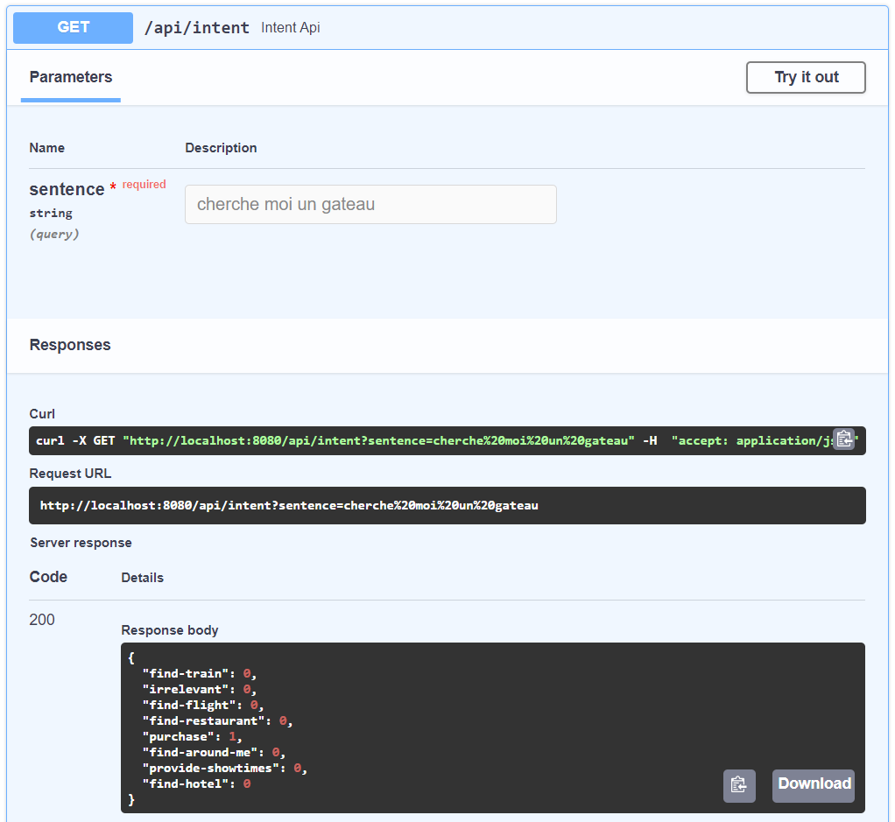
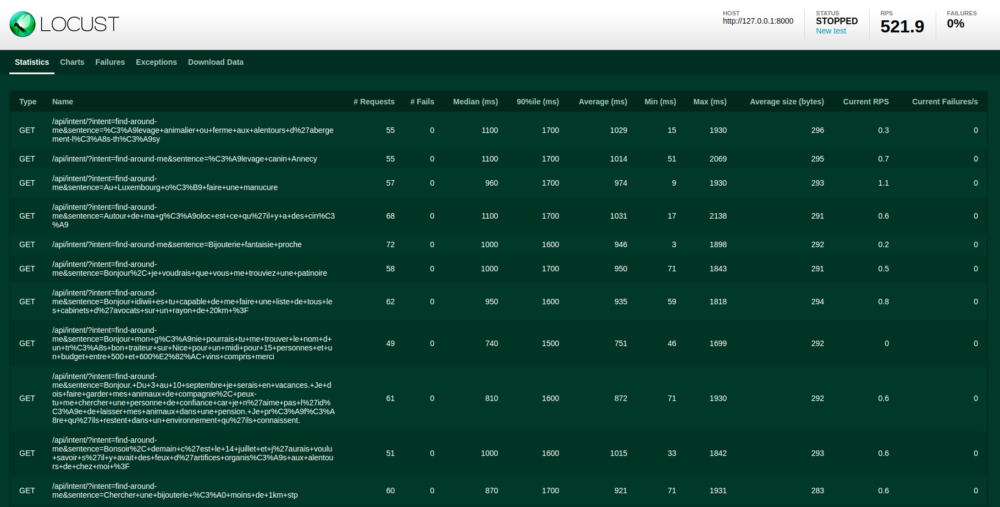
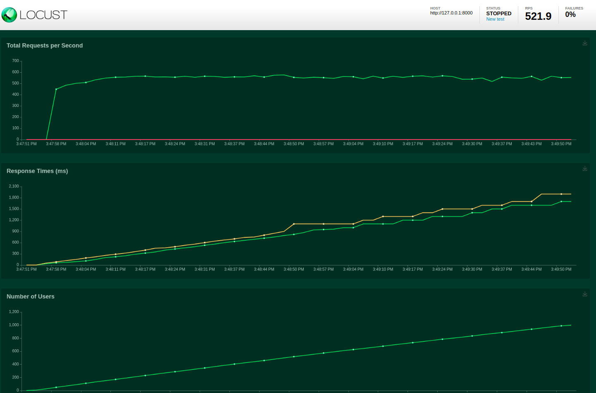
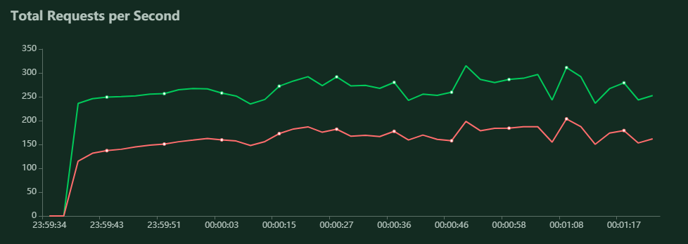
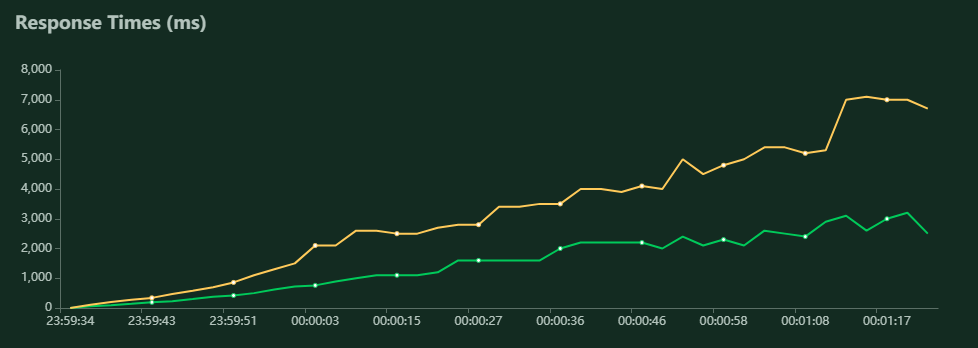
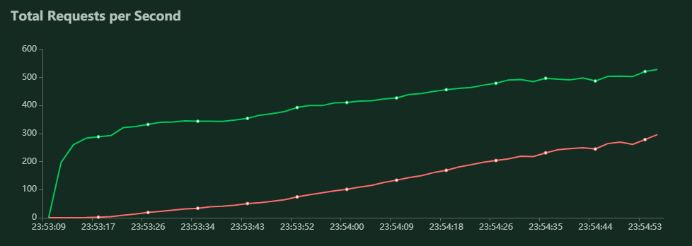
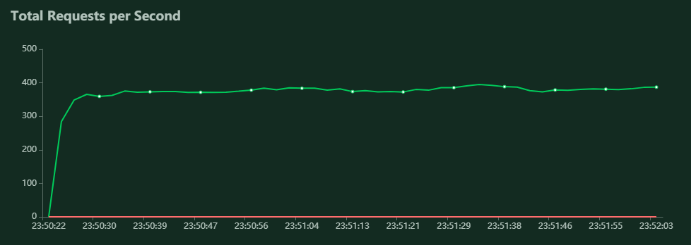
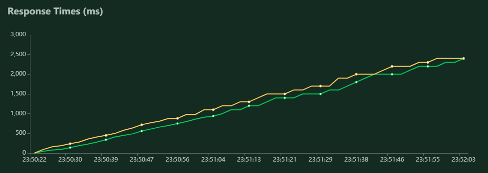
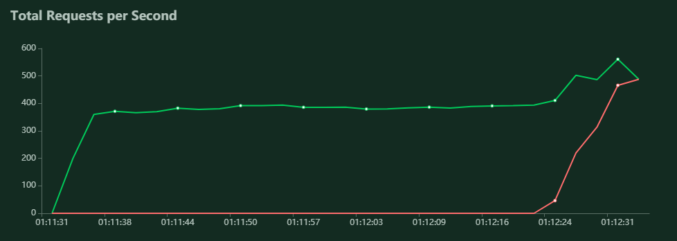
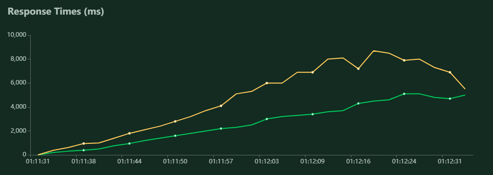

# Creating NLU API for intent classification

## This repo contains multiple notebooks and files dealing with the problematics we faced while creating an NLU API for intent classification.

Q1. Analysing the training and evaluation data.

Q2. Evaluating a pretrained model.

Q3. Training and testing our own pipeline using spaCy.

LOSS       P        R        F1
0.096    0.860    0.857    0.858

### Q4. Using FastAPI web framework to provide APIs to our intention model.

The docker image is available on DockerHub: [link](https://hub.docker.com/repository/docker/csj0oe/mlops-wiidii)

Build docker image
```shell
docker build --tag intentclassication .
```

Run docker image
```shell
docker run -d -p 8000:8000 intentclassication
```

Server is now listening on http://localhost:8000.

- To check documentation of the API, check [http://localhost:8080/docs](http://localhost:8080/docs)
- To test the API, check [http://localhost:8080/api/intent?sentence=J%27ai%20besoin%20d%27un%20restaurant%20italien%20pour%20ce%20soir,%20nous%20serons%204%20convives](http://localhost:8080/api/intent/?sentence=J%27ai%20besoin%20d%27un%20restaurant%20italien%20pour%20ce%20soir,%20nous%20serons%204%20convives)

<!--  -->



# Performance testing Flask vs Bottle vs Fast API.

In order to test the performance of the API under load, we used [Locust](https://locust.io/) as a testing tool.


We configured Locust to simulate 1000 users with spawn rate equals to 10 users per second.

```
Spawn rate = 10 users/second
Number Users = 1000
```

<!-- We are using , an ASGI server implementation, using uvloop and httptools.
The screenshot below depicts the test result. -->
<!-- 
 -->

The APIs we are testing use different standard:

* WSGI stands for Web Server Gateway Interface
* ASGI stands for Asynchronous Server Gateway Interface


| Flask | Bottle | Fast API |
|:-:|:-:|:-:|
| WSGI| WSGI | ASGI using [Uvicorn](https://www.uvicorn.org/) |

## Results

|| Total Requests Per Second | Response Time |
|:-:|:-------------------------:|:-------------------------:|
| Flask |   |  | 
|Flask|- The number of requests per second is hovering arround 300 rps <br /> - The percentage of failed requests is very high arround 62%|- Median response time is arround 2300ms <br /> - The Top95 curve and median curve are very far which means that the QoS variance is very high. <br /> - The delay varies alot from user to user. <br /> - Some users experience very big delays 7000ms|
| Bottle |  |  |
|Bottle|- The rps is gradualy increasing from 300 arround 600 rps <br /> - The percentage of failed requests is also increasing reaching 37%|- Median response time is arround 2200ms <br /> - The Top95 curve and median curve are far when the number of users is small. <br /> - The median curve increaces while the Top95 curve remains constant. <br /> - This is mostly due to a timeout delay which constrains the response time.  <br /> - This also explains the increase in the number of failed requests |
| Fast API |  |  | 
|Fast API|- The number of requests per second is relatively constant arround 360 rps <br /> - The percentage of failed requests is 0%|- Median response time is arround 2300ms <br /> - The Top95 curve and median curve are very close which means that the QoS variance is very small. <br /> - All users have the same latency.|


## Conclusion:


`Fast API` in combination with `uvicorn` yielded the best performance during the load tests:

* Very high number of requests per second
* Zero failed requests
* Uniform QoS accross all users

## Further testing

However, we wanted to push the server to its limits and we used the following configuration:

```
Spawn rate = 50 users/second
Number Users = 5000
```

The Fast API started to yield very bad results at arround 2500 users, but not because of the bad API, but because it crashed due to our system limitations.

| Total Requests Per Second | Response Time |
|:-------------------------:|:-------------------------:|
|   |  | 


```shell
File "Q4_fast_api_server.py", line 24, in <module>
    uvicorn.run(app, host=config['HOST'], port=config['PORT'], debug=config['DEBUG'], reload=False, access_log=False)
File "C:\Users\me\anaconda3\envs\mlops\lib\site-packages\uvicorn\main.py", line 386, in run
    server.run()
File "C:\Users\me\anaconda3\envs\mlops\lib\site-packages\uvicorn\server.py", line 48, in run
    loop.run_until_complete(self.serve(sockets=sockets))
File "C:\Users\me\anaconda3\envs\mlops\lib\asyncio\base_events.py", line 475, in run_until_complete
    self.run_forever()
File "C:\Users\me\anaconda3\envs\mlops\lib\asyncio\base_events.py", line 442, in run_forever
    self._run_once()
File "C:\Users\me\anaconda3\envs\mlops\lib\asyncio\base_events.py", line 1426, in _run_once
    event_list = self._selector.select(timeout)
File "C:\Users\me\anaconda3\envs\mlops\lib\selectors.py", line 323, in select
    r, w, _ = self._select(self._readers, self._writers, [], timeout)
File "C:\Users\me\anaconda3\envs\mlops\lib\selectors.py", line 314, in _select
    r, w, x = select.select(r, w, w, timeout)
ValueError: too many file descriptors in select()
```